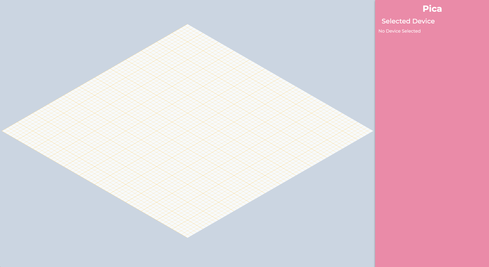

# Pica

Pica is a virtual UWB Controller implementing the FiRa UCI specification.
It has been designed for testing UWB ranging capabilities.
Pica supports the following features:

- Pica keeps an internal representation of a 3-D scene.
- Pica lets multiple clients connect through TCP sockets.
  Each new connection spawns an attached UWB subsystem. Connected hosts can
  interact together as if they existed in a single 3-D scene.
- Pica implements a nice GUI through a web server.
- Pica provides HTTP commands to interact with the scene directly such as create and destroy
  virtual anchors.

# Build and Run

```bash
$> git clone https://github.com/google/pica.git
$> cd pica/
$> cargo run
```

You should recieve the following output:

```
Pica: Listening on: 7000
Pica: Web server started on http://0.0.0.0:3000
```

You can now open the web interface at `http://0.0.0.0:3000` and the HTTP commands documentation
at `http://0.0.0.0:3000/openapi`. The scene should be empty and look like this:



# Command line

A command line tool is available to trigger some action such as creating an anchor.
Run pica in a terminal then open a new one and do:
```
$> cd pica/
$> python3 scripts/console.py
```

If you hit `Enter`, the console will list you all the available commands:
```
device_reset                    Reset the UWBS.
get_device_info                 Retrieve the device information like (UCI version and other vendor specific info).
get_caps_info                   Get the capability of the UWBS.
session_init                    Initialize the session
session_deinit                  Deinitialize the session
session_set_app_config          set APP Configuration Parameters for the requested UWB session.
session_get_app_config          retrieve the current APP Configuration Parameters of the requested UWB session.
session_get_count               Retrieve number of UWB sessions in the UWBS.
session_get_state               Query the current state of the UWB session.
range_start                     start a UWB session.
range_stop                      Stop a UWB session.
get_ranging_count               Get the number of times ranging has been attempted during the ranging session..
pica_create_anchor              Create a Pica anchor
pica_destroy_anchor             Destroy a Pica anchor
pica_get_state                  Return the internal Pica state
pica_init_uci_device            Initialize an uci device
pica_set_position               Set the position of a Device
```

If you wish to create a virtual anchor:

```bash
$> cd pica/ && python3 scripts/console.py # If the console is not started yet
$> --> pica_create_anchor 00:00 # pica_create_anchor <mac_address>
$> --> pica_create_anchor 00:01 # Create another one
```
# Architecture

- *Device* UWB subsystem created for a connected host.
- *Session* UWB ranging session opened by a connected host.
- *Anchor* virtual UWB host, responding to ranging requests from
  connected hosts.

```
                 ┌────────────────────┐
                 │ Web                │
                 │                    │
                 └─────┬─────────▲────┘
                       │         │    HTTP localhost:3000
  ┌────────────────────▼─────────┴───────┐
  │                                      │
  │                 Pica                 │
  │                                      │
  │  ┌────────┐  ┌────────┐  ┌────────┐  │
  │  │Anchor1 │  │Device1 │  │Device2 │  │
  │  ├────────┤  │        │  │        │  │
  │  │Anchor2 │  ├────────┤  ├────────┤  │
  │  ├────────┤  │Session1│  │Session1│  │
  │  │...     │  ├────────┤  ├────────┤  │
  │  │        │  │Session2│  │Session2│  │
  │  └────────┘  └──▲──┬──┘  └──▲──┬──┘  │
  │                 │  │        │  │     │
  └─────────────────┼──┼────────┼──┼─────┘
                    │  │        │  │  TCP localhost:7000
                 ┌──┴──▼──┐  ┌──┴──▼──┐
                 │Client1 │  │Client2 │
                 │        │  │        │
                 ├────────┤  ├────────┤
                 │VirtIO  │  │        │
                 ├────────┤  │        │
                 │UWB HAL │  │        │
                 ├────────┤  │Python  │
                 │Cuttle  │  │console │
                 │fish    │  │        │
                 └────────┘  └────────┘
```

# Http commands

Pica also implements HTTP commands, the documentation is available at `http://0.0.0.0:3000/openapi`.
The set of HTTP commands let the user interact with Pica amd modify its scene.

# Regenerate uci_packets.rs
If you haven't use bluetooth_packetgen before, it is a tool from Android. You can build it and use it
and build it that way:
```bash
# Build bluetooth_packetgen
cd $AOSP_DIR
source build/envsetup.sh
lunch <target>  # Use target 1 if in doubt
m bluetooth_packetgen
export PATH=$PATH:${AOSP_DIR}/out/host/linux-x86/bin/

# Generate the source
cd $PICA_DIR
bluetooth_packetgen \
    --rust \
    --include=src/ \
    --out=src/ \
    src/uci_packets.pdl
```

Then edit the uci_packet.rs to add clippy guards

```
#![allow(clippy::all)]
#![allow(non_upper_case_globals)]
#![allow(non_camel_case_types)]
#![allow(non_snake_case)]
#![allow(unused)]
#![allow(missing_docs)]
```
